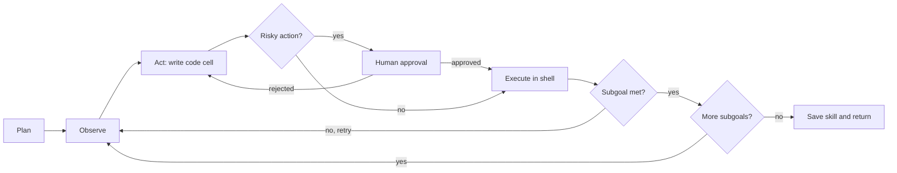

# hermitcrab

```
        _          _
       ( \        / )
        \ \______/ /
     .--'          '--.
    /    o        o    \       hermitcrab
    \    '--------'    /       a browser agent that lives in a borrowed shell
     '-.____________.-'        and clicks things so you don't have to
       /  /  |  |  \  \
```

**hermitcrab** is a browser automation agent that completes multi-step web tasks by writing and running its own Playwright code, one small step at a time.

Like its namesake, it never builds a home of its own. Every run moves into a fresh, disposable shell (a locked-down sandbox container), does its job, and leaves the shell behind. The brain stays outside; only the claws go in.

> Status: early work in progress. The design is settled, the code is being built. Numbers, demos and benchmarks will land here when they're real, not before.

---

## What it does

Give it a goal in plain English:

```
"Log in, add the cheapest item to the cart, check out with these details,
 and return the order confirmation."
```

hermitcrab will:

1. **Plan:** split the goal into subgoals, each with a checkable success condition
2. **Look:** read a compact snapshot of the page (accessibility tree, not raw HTML)
3. **Act:** write a short Python code cell against a live Playwright `page`
4. **Run:** execute that cell inside a sandboxed browser, never in its own process
5. **Check:** have an independent verifier confirm the subgoal actually happened
6. **Ask:** pause for a human before anything irreversible (submit, pay, delete)
7. **Remember:** save successful runs as replayable skills, and repair them when sites change

---

## How it works

### The crab and the shell

```
            THE CRAB (worker)                        THE SHELL (one per run)
   +----------------------------------+        +-------------------------------+
   |  LangGraph agent                 |  code  |  Chromium + code executor     |
   |  planner / actor / verifier      | -----> |  persistent `page` session    |
   |  holds the LLM key               |  cells |  no keys, no host files       |
   |  decides what to do next         | <----- |  allowlisted domains only     |
   +----------------------------------+ result +-------------------------------+
                                                      thrown away after the run
```

The LLM writes the code, but the code never runs next to your API keys, database or files. It runs in a disposable container that can only reach the websites allowed for that task.

### The agent graph



- **Code actions, not JSON tool calls.** One cell can loop, branch and chain several clicks, instead of one LLM round trip per click.
- **Independent verification.** The verifier checks the page state itself and doesn't take the actor's word for it.
- **Retry, then replan.** A failing cell gets its error back. After 3 failures on one subgoal, the planner rethinks the plan.
- **Human in the loop.** Irreversible actions trigger a LangGraph `interrupt()`. The run is checkpointed in Postgres and resumes when you decide.
- **Context management.** Old steps are condensed into progress notes, so long runs don't drown in their own history.

### The shell, layer by layer

| Layer | What it stops |
| --- | --- |
| Fresh container per run | One task leaking cookies or data into the next |
| No secrets inside | LLM-written code reading your API keys or DB password |
| Read-only filesystem, CPU/memory/pid limits | Runaway loops taking down the host |
| AST check before every cell | `import os`, `subprocess`, `socket`, `open`, `exec`, `eval` |
| Domain allowlist (Playwright routes) | A malicious page sending your data somewhere else |
| Human approval gate | Irreversible clicks happening without you |
| Secrets by name only | The LLM ever seeing a real password |

---

## Tech stack

| Part | Tech |
| --- | --- |
| Agent | Python, LangGraph, LangChain |
| Browser | Playwright (Chromium) |
| Sandbox | Docker, one container per run |
| API and live view | FastAPI, server-sent events |
| Storage | Postgres + pgvector (runs, steps, skills, checkpoints), S3 (screenshots) |
| Observability | Langfuse |
| CI | GitHub Actions, GHCR |
| Deploy | AWS EC2 first, then ECS Fargate + RDS |

---

## Quickstart

> Planned interface. These commands will work once v0 ships.

```bash
git clone https://github.com/<you>/hermitcrab.git
cd hermitcrab
cp .env.example .env            # add your LLM API key
docker compose up --build       # API, worker, Postgres
```

Start a run:

```bash
curl -X POST http://localhost:8000/runs \
  -H "Content-Type: application/json" \
  -d '{
        "goal": "Log in and add the cheapest item to the cart",
        "start_url": "https://www.saucedemo.com",
        "allowed_domains": ["saucedemo.com"],
        "secrets": {"user": "standard_user", "password": "secret_sauce"}
      }'
```

Then open `http://localhost:8000` to watch the crab work live, step by step, and approve anything risky.

---

## API

| Method | Endpoint | Does |
| --- | --- | --- |
| `POST` | `/runs` | Start a run |
| `GET` | `/runs/{id}` | Status, result, cost |
| `GET` | `/runs/{id}/stream` | Live steps and screenshots (SSE) |
| `POST` | `/runs/{id}/approve` | Approve or reject a paused action |
| `GET` | `/skills` | Saved, replayable skills |
| `GET` | `/stats` | Success rate, steps and cost across runs |

---

## Project layout

```
hermitcrab/
  agent/          LangGraph graph, nodes, prompts, state
  shell/          sandbox executor (runs inside the container)
  api/            FastAPI app and live view UI
  skills/         skill compiler, replay and repair
  db/             models and migrations
  tasks/          dev task set with success checks
  tests/
  docker/         Dockerfiles for worker and shell
  docker-compose.yml
```

---

## Roadmap

- [ ] **v0, the first shell:** code-action loop, sandboxed browser, planner/actor/verifier, dev task set, deployed on EC2
- [ ] **v1, the crab learns:** human approval, skill library with replay and self-repair, live view and trace viewer
- [ ] **v2, the crab gets measured:** public benchmark subset, ablations (code actions vs JSON tools, with and without verifier), failure taxonomy, write-up
- [ ] **v3, a bigger shell:** ECS Fargate with one task per run, RDS, ALB, CloudWatch
- [ ] **Project 2:** RL-train a small model on hermitcrab's own trajectories (GRPO)

---

## Why a hermit crab?

Because the whole design is one idea: **the thing that thinks never lives where the risky work happens.** Hermit crabs borrow a shell, use it, and move on. hermitcrab borrows a container, runs the LLM's code in it, and throws it away.

Also, crabs are great at grabbing things.

---

## Responsible use

hermitcrab is built and tested on practice sites made for automation (saucedemo.com, the-internet.herokuapp.com, demoqa.com, toscrape.com). Don't point it at sites whose terms forbid automation, and don't use it to bypass CAPTCHAs or anti-bot protections.

## License

MIT
